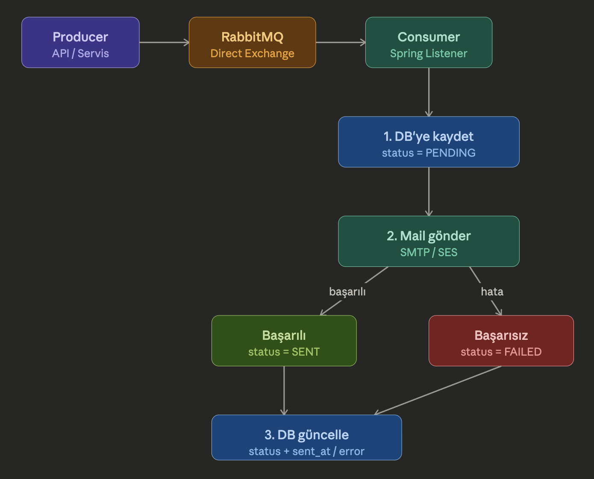

# Notification Service

Bu proje, Spring Boot kullanarak bir bildirim mikroservisi sağlar. Servis RabbitMQ üzerinden e-posta gönderim kuyruğuna mesaj atar ve "account verification", "password change" ve "order received" endpoint'leri sunar. 

## Mimari



1. **REST API** gelen isteği karşılar ve Producer'ı tetikler.
2. **Producer (API / Servis)** mesajı RabbitMQ Direct Exchange'e iletir.
3. **Consumer (Spring Listener)** mesajı queue'dan alır ve DB'ye `PENDING` statüsüyle kaydeder.
4. **Mail gönderimi** gerçekleştirilir (SMTP / SES).
5. Gönderim başarılıysa DB `SENT`, başarısızsa `FAILED` olarak güncellenir (`sent_at` veya `error` alanıyla birlikte).

## Kullanılan Teknolojiler

- Java 17+ (projede belirtilen sürüm)
- Spring Boot
- RabbitMQ (`spring-boot-starter-amqp`)
- PostgreSQL (JPA yapılandırması)
- Lombok

## API Uç Noktaları

Tüm uç noktalar `POST` olarak çalışıyor:

- `POST /notifications/verify-account`
- `POST /notifications/change-password`
- `POST /notifications/order-received`

İstek gövdesi `NotificationDTO` ile gönderilir (ör: receiver, title, body, dynamicValue).

## Çalıştırma

1. RabbitMQ ve PostgreSQL localde veya docker da çalışır durumda olmalı.
2. `src/main/resources/application.properties` dosyasındaki ayarları ortamınıza göre güncelleyin.
3. Projeyi çalıştırın:

```bash
./mvnw spring-boot:run
```

Ya da jar paketle:

```bash
./mvnw clean package
java -jar target/notificationService-0.0.1-SNAPSHOT.jar
```

## Local Test Örneği

`curl` ile `verify-account` çağrısı:

```bash
curl -X POST http://localhost:8080/notifications/verify-account \
  -H "Content-Type: application/json" \
  -d '{"receiver":"user@example.com","title":"Doğrulama","body":"Lütfen hesabınızı doğrulayın","dynamicValue":"12345"}'
```

## Dikkat

- `NotificationServiceImpl` içinde `changePassword` ve `orderReceived` şu anda dönüş değeri oluşturuyor ancak RabbitMQ'ya mesaj göndermiyor. Geliştirme yapılabilir.
- Mail gönderimi/smtp bilgilerinizi `application.properties`'e ekleyin.
